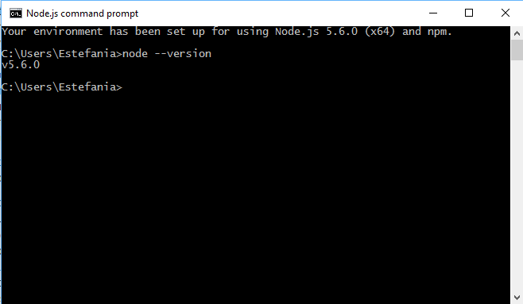

Tutorial NodeJS, Express, Atom, GitHub, Cloud9 y Markdown
======================================================

## Instalación de NodeJS

Es un entorno Javascript del lado del servidor, basado en eventos. Node ejecuta javascript utilizando el motor V8, desarrollado por Google para uso de su navegador Chrome. Aprovechando el motor V8 permite a Node proporciona un entorno de ejecución del lado del servidor que compila y ejecuta javascript a velocidades increíbles. El aumento de velocidad es importante debido a que V8 compila Javascript en código de máquina nativo, en lugar de interpretarlo o ejecutarlo como bytecode. Node es de código abierto, y se ejecuta en Mac OS X, Windows y Linux.

Se puede descargar pinchando este enlace: [Node.js](https://nodejs.org/en/). Seguidamente, se siguen los pasos del instalador de **Node.js**.

Abriendo la consola de **NodeJS** se puede verificar la instalación ha sido un éxito.




## Instalación de Express
Para instalar **Express** hay que abrir la consola de **NodeJS** y escribir el siguiente comando:

> `npm install express --save`


## Instalación del editor de texto Atom

**Atom** es un editor de texto orientado al desarrollo de aplicaciones; una herramienta desarrollada por Github que se ha publicado en beta privada.


Dado que se va a utilizar el formato **Markdown** es bueno saber que en **Atom** se puede obtener una vista preliminar del contenido del fichero Markdown ya que incorpora el formato **GitHub Markdown** con el comando:

**Cosas interesantes**

> * Markdown preview `ctrl+shift+m`
> * Markdown export to HTML `Save As HTML`


## Instalación de GitHub Desktop

**GitHub** es una plataforma de desarrollo colaborativo para alojar proyectos utilizando el sistema de control de versiones **Git**.
**GitHub Desktop** es la aplicación de escritorio que permite contribuir en proyectos de GitHub y GitHub Enterprise.</p>

Para descargarlo puede pinchar el siguiente enlace: [GitHub Desktop](https://desktop.github.com/)

Una vez instalado se procede a la configuración:
1. Autenticarse con las credenciales de **GitHub** para poder sincronizar el repositorio tanto local como remoto. En caso de no tener cuenta puede crearse en la página de **GitHub**.

  

2.  Búsqueda de los repositorios que hay asociados a la cuenta.

  

3. Ejemplo de zona de trabajo de un repositorio concreto

  


## Cloud 9

Es un IDE de desarrollo online, para su uso será necesario crear una cuenta en la página oficial o acceder con las credenciales de GitHub si ya se dispone de una cuenta. Una vez registrados podremos crear proyectos de varias tecnologías como puede ser NodeJS, HTML5, C++, Ruby On Rails, etc.


Se puede acceder al entorno pinchando el siguiente enlace: [Cloud9](https://c9.io/)

Si se dispone de algún proyecto en un repositorio de GitHub se podrá asociar a **Cloud9** para trabajar en él tan solo creando un “`nuevo workspace`” y añadiendo la url *git* del correspondiente repositorio.


Además, **Cloud9** permite el trabajo en equipo en el IDE añadiendo miembros al workspace.

## Markdown

Markdown es un lenguaje de marcado ligero parecido al que se emplea en muchas wikis y basado originalmente en convenciones existentes en el marcado de los los correos electronicos. Emplea texto plano, procurando que sea legible pero consiguiendo que se convierta en XHTML correctamente formateado.

Sintaxis:


Encabezados
```
# Encabezado H1
## Encabezado H2
### Encabezado H3
```
Tipografía
```
**Negrita**
*Cursiva*
> Citas
Parrafo separar por lineas en blanco
`Codigo`
```
Recursos
```

* [Links](https://example.com)
```
Listas
```
1. Lista 1
2. Lista 2

* Lista 1
* Lista 2
```

**Recursos:**

* [NodeJS](https://nodejs.org)
* [Express](http://expressjs.com)
* [Atom IDE](https://atom.io)
* [GitHub Desktop](https://desktop.github.com)
* [GitHub Pages](https://pages.github.com/)
* [Cloud 9 IDE](https://c9.io)
* [Markdown](http://daringfireball.net/projects/markdown/)
